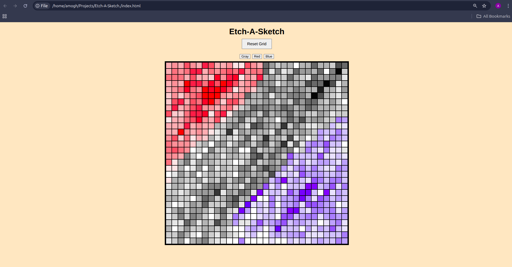

# 🎨 Etch-a-Sketch — DOM Manipulation Learning Project

This project is a **learning-focused implementation** of an Etch-a-Sketch–style drawing grid built using **vanilla HTML, CSS, and JavaScript**.

The primary goal of this project was **not visual polish or production readiness**, but to deeply understand **DOM manipulation, Flexbox layouts, event handling, and state management in JavaScript** through hands-on practice.

---

## 📸 Demo / Preview

## 🧠 Project Purpose

This project was created as a **fundamentals practice exercise** to better understand how JavaScript interacts with the DOM and how user interactions can dynamically modify a webpage.

It focuses on:

- Building UI elements dynamically using JavaScript
- Managing shared state across interactions
- Debugging layout and event-related issues
- Writing readable, intentional code

---

## ✨ Features

- 🟦 Dynamically generated grid (up to **100 × 100**)
- 🎨 Multiple selectable drawing colors
- 🖱️ Click-and-drag drawing (not hover-based)
- 🌑 Progressive darkening effect  
  *(Each interaction darkens a square by 10%, reaching full darkness after 10 interactions)*
- 🔄 Reset grid with user-defined size
- 🧩 Built entirely using **vanilla JavaScript** (no frameworks)

---

## 🛠️ Technologies Used

- **HTML5** — page structure
- **CSS3 (Flexbox)** — grid layout and styling
- **JavaScript (ES6)** — DOM manipulation and event handling
